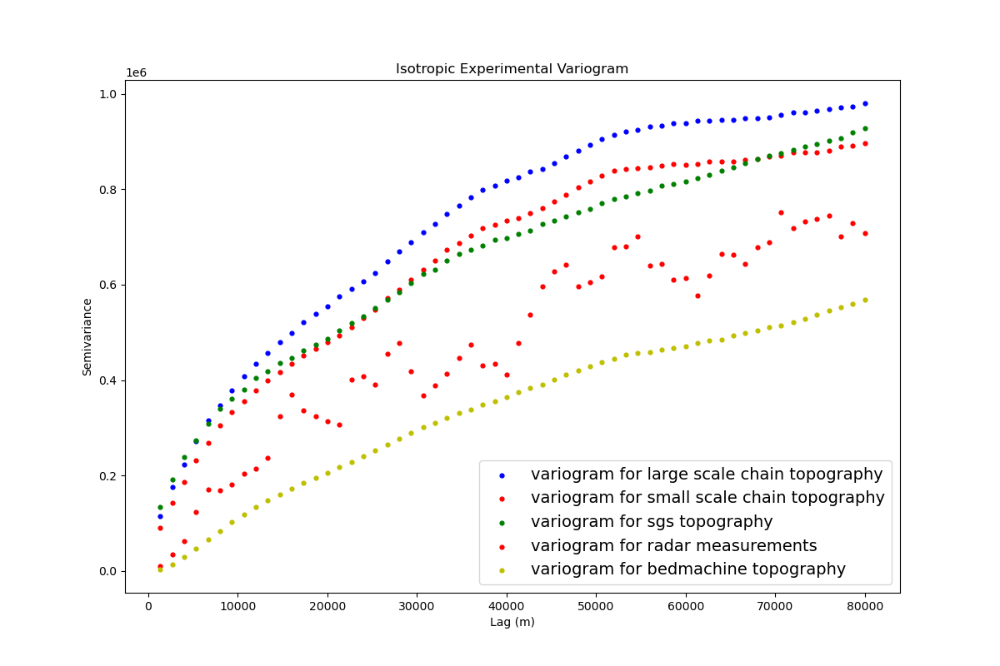

# Using Markov Chain Monte Carlo to Produce Bed Realizations of Scott Glacier
Part of a larger project to map subglacial topography to quantify the uncertainty in sea level rise predictions.

The bed topography beneath glaciers and near their grounding line (not pictured), can greatly affect their flow and retreat dynamics. As such, we need to determine just how variable these sub-glacial topographies can be in order to predict the impact of glacial melting on sea level rise based on a variety of climate projections.

# Methods
We use Tutorial 1 (No tutorials present yet) to isolate our study area from bedmap3, a database for Antarctic topographical data, by converting geographic coordinates to polar stereographic and establish a region of high velocity for future operations. We use Tutorial 2 to create a Sequential Gaussian Simulation (SGS) realization of the subglacial topography based on a matern variogram of our normalized bed. Tutorial 3 uses this SGS bed to run many large-scale Markov Chain Monte Carlo (MCMC) iterations constrained to certain physical and topographical constraints in order to produce many realizations with decreasing loss. One such physical constraint is mass conservation, which pushes the simulation to have a total mass loss and mass gain equal to a known value. The topographical constraints require areas with radar measurements or above-ground regions to match the data. Tutorial 4 continues with the small-scale MCMC, keeping the afformentioned constraints and iteratively changing small portions of the previous step using SGS to further minimize loss.

# Use
Install the code and bedmap3.nc data file if target glacier is different, ScottGlacierGriddedFinal.csv if not. Run tutorials 1-4, changing variables as necessary. Adjust coordinates in T1 and velocity threshhold if needed. Adjust resolution and variogram radius as needed in T2 (keep these the same for future tutorials). Adjust sigma3 for best bell-curve shape, the range max to match coordinates, and block x and y for for T3. Adjust block sizes again (they should be smaller) for T4. In T3 and T4, change iterations and count and run until a loss is reached that matches bemachine (dotted red line).

# Poster
First poster draft. Comments on structure and color scheme welcome.

# Target Audience

