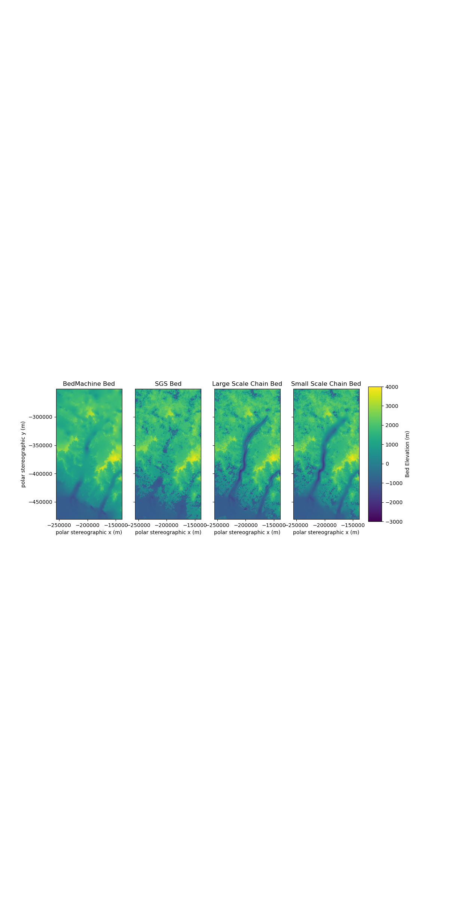
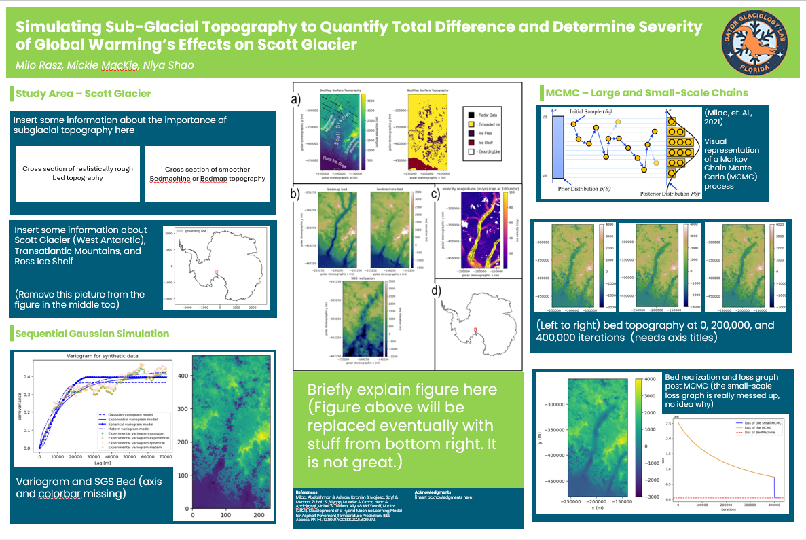
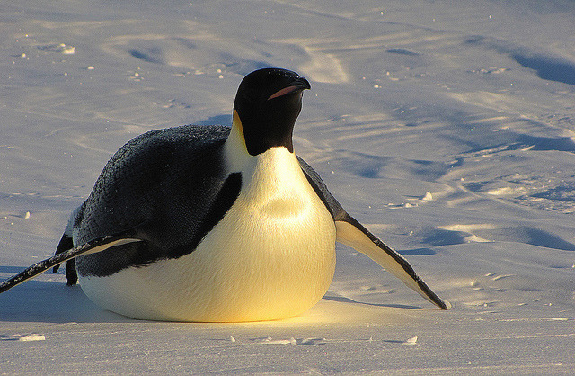

# Using Markov Chain Monte Carlo to Produce Bed Realizations of Scott Glacier
Authors: Milo Rasz, Dr. Emma MacKie, Niya Shao

## Overview
A part of GatorGlaciology's larger project DEMOGORGN to map subglacial topography to quantify the uncertainty in sea level rise predictions. The bed topography beneath glaciers and near their grounding line can greatly affect their flow and retreat dynamics. As such, we need to determine just how variable these sub-glacial topographies can be in order to predict the impact of glacial melting on sea level rise based on a variety of climate projections. Data from ice-penetrating radar is limited, so estimations and interpolations of the underlying glacial bed must be made. Large databases of these interpolations exist and are the foundational data sets of this project. However, many of these data sets lack physical constraints such as ice flux divergence and thus can be improved. This is what this project seeks to accomplish using iterative Sequential Gaussian Simulation (SGS) and Markov Chain Monte Carlo (MCMC) to produce variations of antarctic bed database Bedmap3 that follow specific physical constraints that will produce bed realizations more closely resembling real antarctic beds in roughness. The following figure shows the progress of bed realizations throughout the project.

### Scott Glacier
Scott Glacier is roughly 190 km long, part of West Antarctica, and runs north to south feeding into the northern Ross Ice Shelf (Alberts, 1995). It is surrounded by and flows through the Transantarctic Mountains. The following figure shows its location relative to the Antarctic continent.

### Methodology
(Methods informed by Shao, et. al., n.d.)
* `T1_LoadData.ipynb` isolates our study area from bedmap3, a database for Antarctic topographical data, by converting geographic coordinates to polar stereographic and establishing a region of high velocity.
* `T2_StatisticalAnalysis.ipynb` creates an SGS realization of the subglacial topography based on a matern variogram of our normalized bed. 
* `T3_LargeScaleChain.ipynb` uses this SGS bed to run many large-scale MCMC iterations constrained to physical and topographical criteria to produce many realizations with decreasing loss. One such physical constraint is mass conservation, which pushes the simulation to have a total mass loss and mass gain equal to a known value. The topographical constraints require areas with radar measurements or above-ground regions to match the data.
* `T4_SmallScaleChain.ipynb` continues with the small-scale MCMC, keeping the afformentioned constraints and iteratively changing small portions of the previous step using SGS to further minimize loss.

This graphic demonstrates the MCMC process (Milad, et. al., 2021). The first dot is the original, unchanged bed data. Each arrow, the length of which is known as step size, represents the perturbation from one bed realization to the next realization (or dot in this case). These new points must be in some acceptable range of values or they are rejected (the dashed dots and arrows). In this case, the loss is what determines if a realization is acceptable, where lower is better. While not depicted, over time these realizations (dots and arrows) should converge to a smaller range of more acceptable points when the loss stops decreasing with new realizations. Realizations within this small range are found in the large and small scale chains of T3 and T4 respectively.

## Use
Install the code and bedmap3.nc data file if target glacier is different, ScottGlacierGriddedFinal.csv if not. Run tutorials 1-4, changing variables as necessary. Adjust coordinates in T1 and velocity threshhold if needed. Adjust resolution and variogram radius as needed in T2 (keep these the same for future tutorials). Adjust sigma3 for best bell-curve shape, the range max to match coordinates, and block x and y for for T3. Adjust block sizes again (they should be smaller) for T4. In T3 and T4, change iterations and count and run until a loss is reached that matches bemachine (dotted red line).

## Data
* **BedMachine Antarctica V3:** Morlighem, M. (2022). MEaSUREs BedMachine Antarctica. (NSIDC-0756, Version 3). [Data Set]. Boulder, Colorado USA. NASA National Snow and Ice Data Center Distributed Active Archive Center. https://doi.org/10.5067/FPSU0V1MWUB6
* **BedMap V3:** Fretwell, P., Pritchard, H., Fremand, A., Bodart, J., Aitken, A., Bamber, J., Bell, R., Bianchi, C., Bingham, R., Blankenship, D., Casassa, G., Catania, G., Christianson, K., Conway, H., Corr, H., Cui, X., Damaske, D., Damn, V., Drews, R., ... Zirizzotti, A. (2022). BEDMAP3 - Ice thickness, bed and surface elevation for Antarctica - standardised shapefiles and geopackages (Version 1.0) [Data set]. NERC EDS UK Polar Data Centre. https://doi.org/10.5285/a72a50c6-a829-4e12-9f9a-5a683a1acc4a
* **InSAR-Based Antarctica Ice Velocity Map V2:** Rignot, E., Mouginot, J. & Scheuchl, B. (2017). MEaSUREs InSAR-Based Antarctica Ice Velocity Map. (NSIDC-0484, Version 2). [Data Set]. Boulder, Colorado USA. NASA National Snow and Ice Data Center Distributed Active Archive Center. https://doi.org/10.5067/D7GK8F5J8M8R
* **MOA 2014 Image Map V1:** Haran, T., Klinger, M., Bohlander, J., Fahnestock, M., Painter, T. & Scambos, T. (2018). MEaSUREs MODIS Mosaic of Antarctica 2013-2014 (MOA2014) Image Map. (NSIDC-0730, Version 1). [Data Set]. Boulder, Colorado USA. NASA National Snow and Ice Data Center Distributed Active Archive Center. https://doi.org/10.5067/RNF17BP824UM

   (This dataset is not used within the tutorials but can be used to establish a glacier's grounding line. Due to issues with the study region, a consistent grouning line is not established.) 
*  **Antarctic Grounded Ice Sheet Elevation Change V1:** Nilsson, J., Gardner, A. S. & Paolo, F. (2023). MEaSUREs ITS_LIVE Antarctic Grounded Ice Sheet Elevation Change. (NSIDC-0782, Version 1). [Data Set]. Boulder, Colorado USA. NASA National Snow and Ice Data Center Distributed Active Archive Center. https://doi.org/10.5067/L3LSVDZS15ZV
* **Surface Mass Balance:** van Wessem, J. M., van de Berg, W. J., Noël, B. P., van Meijgaard, E., Amory, C., Birnbaum, G., Jakobs, C. L., Krüger, K., Lenaerts, J. T., Lhermitte, S., Ligtenberg, S. R., Medley, B., Reijmer, C. H., van Tricht, K., Trusel, L. D., van Ulft, L. H., Wouters, B., Wuite, J., & van den Broeke, M. R. (2018). Modelling the climate and surface mass balance of polar ice sheets using racmo2 – part 2: Antarctica (1979–2016). The Cryosphere, 12(4), 1479–1498. https://doi.org/10.5194/tc-12-1479-2018

## Software and Packages
* **Conda-Forge (Miniforge):** conda-forge community. (2015). The conda-forge Project: Community-based Software Distribution Built on the conda Package Format and Ecosystem. Zenodo. https://doi.org/10.5281/zenodo.4774217

  The following packages are all present within the .yml file and should be automatically downloaded when a conda environment uses said .yml file. However, they can be downloaded on their own.
* **numpy:** Harris, C.R., Millman, K.J., van der Walt, S.J. et al. Array programming with NumPy. Nature 585, 357–362 (2020). DOI: 10.1038/s41586-020-2649-2.
* **matplotlib:** J. D. Hunter, "Matplotlib: A 2D Graphics Environment", Computing in Science & Engineering, vol. 9, no. 3, pp. 90-95, 2007.
* **pandas:** The pandas development team. (2025). pandas-dev/pandas: Pandas (v2.3.3). Zenodo. https://doi.org/10.5281/zenodo.17229934
* **gstatsim:** MacKie, E. J., Field, M., Wang, L., Yin, Z., Schoedl, N., Hibbs, M., & Zhang, A. (2023). GStatSim v1.0: A python package for geostatistical interpolation and conditional simulation. Geoscientific Model Development, 16(13), 3765–3783. https://doi.org/10.5194/gmd-16-3765-2023 
* **xarray:** Hoyer, S. & Hamman, J., (2017). xarray: N-D labeled Arrays and Datasets in Python. Journal of Open Research Software. 5(1), p.10. DOI: https://doi.org/10.5334/jors.148
* **verde:** Uieda, L. (2018). Verde: Processing and gridding spatial data using Green’s functions. Journal of Open Source Software, 3(29), 957. doi:10.21105/joss.00957
* **skgstat:** Mälicke, M.: SciKit-GStat 1.0: a SciPy-flavored geostatistical variogram estimation toolbox written in Python, Geosci. Model Dev., 15, 2505–2532, https://doi.org/10.5194/gmd-15-2505-2022, 2022.
* **tqdm:** da Costa-Luis, (2019). tqdm: A Fast, Extensible Progress Meter for Python and CLI. Journal of Open Source Software, 4(37), 1277, https://doi.org/10.21105/joss.01277

## References
* Alberts, F. (2 Ed.). (1995). Geographic names of the Antarctic (Report Nos. 95–157; 2nd ed., Report, p. 864). USGS Publications Warehouse. https://pubs.usgs.gov/publication/70039167
* Milad, Abdalrhman & Adwan, Ibrahim & Majeed, Sayf & Memon, Zubair & Bilema, Munder & Omar, Hend & Abdolrasol, Maher & Usman, Aliyu & Md Yusoff, Nur Izzi. (2021). Development of a Hybrid Machine Learning Model for Asphalt Pavement Temperature Prediction. IEEE Access. PP. 1-1. 10.1109/ACCESS.2021.3129979.
* Shao, N., MacKie, E., Field, M., & McCormack, F. (n.d.). A Markov chain Monte Carlo approach for geostatistically simulating mass-conserving subglacial topography. Journal of Glaciology. https://doi.org/10.31223/x5sb2r

## Poster
First poster draft. Comments on structure and color scheme welcome.

## Target Audience

